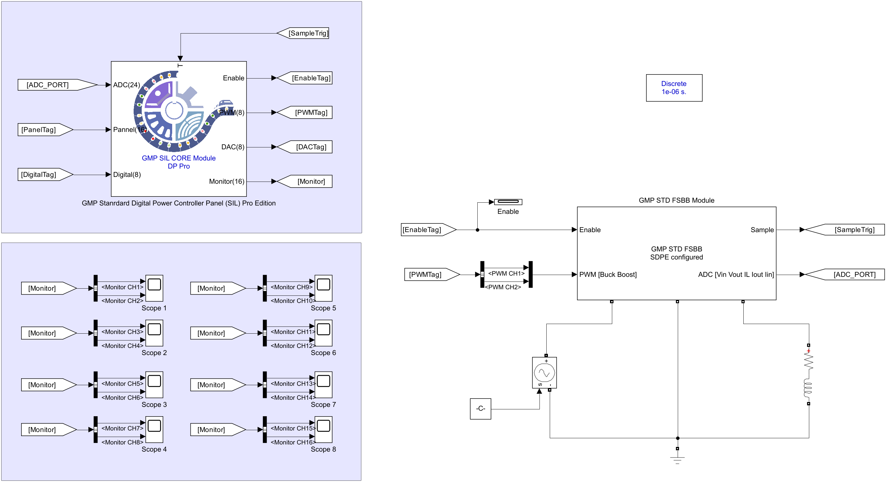
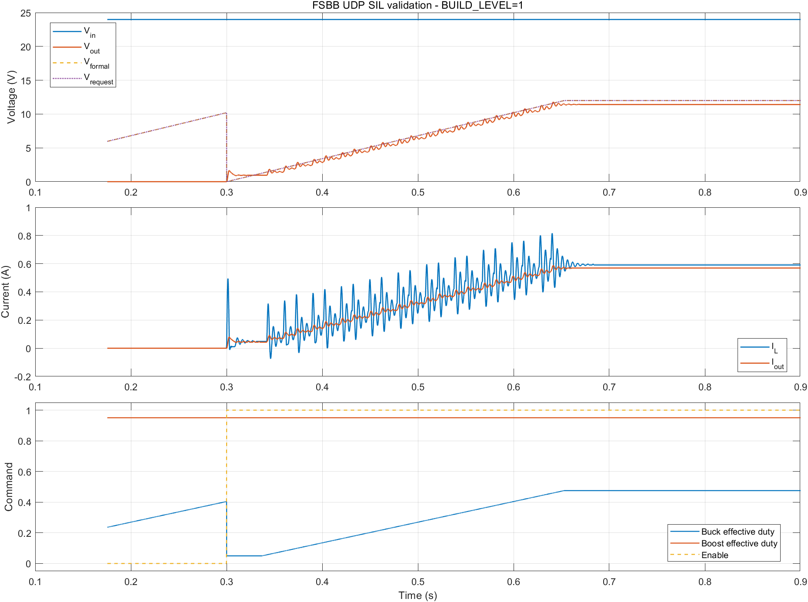
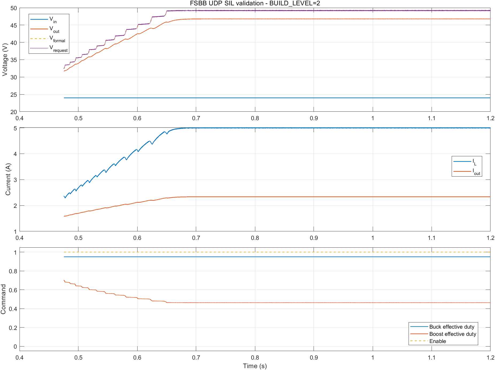
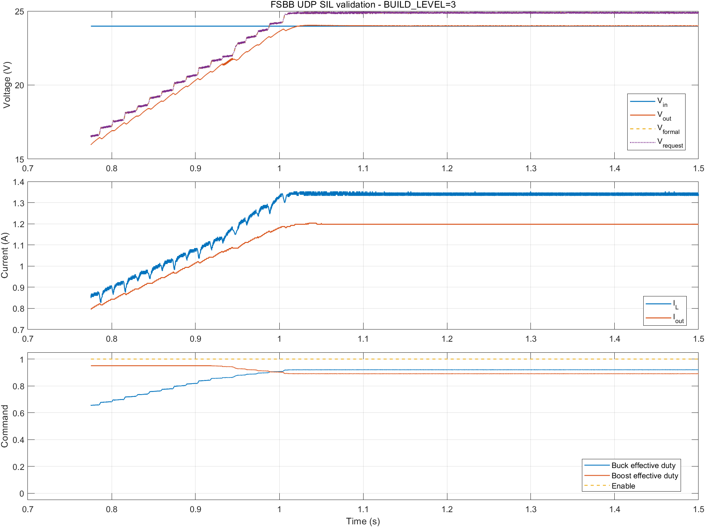

# FSBB UDP/SIL 联合仿真实验报告

## 1. 实验目的与已验证状态

本实验使用同一套 FSBB C 控制代码，通过 UDP 与 Simulink 中的四开关非反相 Buck-Boost 功率级联合运行，依次验证：

1. BUILD_LEVEL 1：电压开环、PWM 极性、ADC 和软启动；
2. BUILD_LEVEL 2：电感电流闭环；
3. BUILD_LEVEL 3：输出电压外环与电感电流内环串级控制。

当前归档版本已完成三个级别的验证。默认配置为 `BUILD_LEVEL=(3)`，最终状态均为 CiA402 `Operation Enabled`、输出使能为 1。

## 2. 目录与关键文件

仿真工作目录：

```text
E:\lib\gmp_pro\ctl\suite\dps_fsbb\project\simulate
```

| 文件 | 用途 |
| --- | --- |
| `MCS_STD_FSBB_MODEL.slx` | FSBB Simulink 功率级与 UDP/SIL 面板 |
| `sdpe_mgr/sdpe_requirement.json` | BUILD_LEVEL、控制器、主电路、ADC、传感器和模型参数的唯一配置入口 |
| `sdpe_mgr/sdpe_generate.bat` | 校验 SDPE 并生成 C 头文件和 MATLAB 初始化脚本 |
| `configure_fsbb_model.m` | 配置模型回调、Mask 参数和固定接线 |
| `GMP_Motor_Control_simulink.sln` | Windows SIL 控制器工程 |
| `run_fsbb_cosim.m` | 启动当前配置的普通联合仿真 |
| `run_fsbb_validation.m` | 自动启动控制器、采集波形并生成 JSON 指标 |

## 3. 软件环境

已验证环境为 Windows、MATLAB/Simulink R2024b 和 Visual Studio C++ x64 工具链。MATLAB 需要能加载模型所用的 Simscape Electrical/电力电子模块，以及以下 GMP UDP S-function：

```text
E:\lib\gmp_pro\tools\gmp_sil\udp_helper_v2\mdl_asio_helper\bin\x64\Debug
```

该路径会由模型回调自动加入 MATLAB 搜索路径。首次实验前确认 Python 可用，因为 SDPE 生成脚本会调用 `tools/SDPE_v2/sdpe.py`。

## 4. 功率级接线

非反相四开关 Buck-Boost 主回路为：

```text
Vin+ -> Buck 桥臂中点 -> L -> Boost 桥臂中点 -> Vout+
Vin- -------------------------------------------------> Vout-
```




PWM 向量必须保持 `[Buck, Boost]`：

- CH1：输入侧 Buck 上管占空比；
- CH2：控制器给出 Boost 低侧 Q4 命令，接口层转换成模型需要的上侧 Q3 占空比；
- 不要通过交换两个 PWM 通道来修正极性。

ADC 向量顺序固定为：

| 索引 | 信号 | 正方向/用途 |
| ---: | --- | --- |
| 0 | `Vin` | 输入端相对公共负极的电压 |
| 1 | `Vout` | 输出端相对公共负极的电压 |
| 2 | `IL` | 从 Buck 中点流向 Boost 中点的主电感电流 |
| 3 | `Iout` | 从变换器流向负载的 Boost 侧电流 |
| 4 | `Iin` | 从电源流入变换器的 Buck 侧电流，目前作为诊断量 |

传感器模块直接输出 ADC 码。当前为 12 位 ADC，双向电流传感器偏置 1.65 V，因此零电流约为 2048 码。

## 5. 关键仿真参数

以下参数均在 `sdpe_mgr/sdpe_requirement.json` 中修改，不要直接编辑生成的 `.h` 或 `_matlab_init.m`：

| 类别 | 宏 | 当前值 | 含义 |
| --- | --- | ---: | --- |
| 工况 | `BUILD_LEVEL` | 3 | 1 开环；2 电流环；3 电压/电流串级环 |
| 输入 | `FSBB_INPUT_VOLTAGE_NOMINAL` | 24 V | 模型直流输入 |
| 负载 | `FSBB_PARAM_RLOAD_MIN` | 20 Ω | 输出电阻负载 |
| 主电路 | `FSBB_PARAM_L` | 1.5 mH | 主电感 |
| 主电路 | `FSBB_PARAM_CIN/COUT` | 440 µF | 输入/输出电容 |
| 指令 | `FSBB_OPEN_LOOP_VOLTAGE_COMMAND` | 12 V | BL1 开环等效电压指令 |
| 指令 | `FSBB_DEFAULT_CURRENT_LIMIT` | 5 A | BL2 电感电流指令/BL3 限流 |
| 指令 | `FSBB_DEFAULT_OUTPUT_VOLTAGE` | 24 V | BL3 输出电压指令 |
| 控制 | `FSBB_CURRENT_LOOP_BANDWIDTH` | 800 Hz | 电流环目标带宽 |
| 控制 | `FSBB_VOLTAGE_LOOP_BANDWIDTH` | 40 Hz | 电压外环目标带宽 |
| 斜率 | `FSBB_VOLTAGE_RAMP_PU_S` | 1 pu/s | 电压软启动斜率 |
| 斜率 | `FSBB_CURRENT_RAMP_PU_S` | 1 pu/s | 电流指令斜率 |
| ADC | `CTRL_ADC_RESOLUTION` | 12 bit | 传感器量化位数 |

参数修改原则：先确认电压、电流和功率没有超过模型器件及保护阈值，再增加带宽或指令。电压环带宽应显著低于电流环带宽。

## 6. 从配置到启动仿真的完整步骤

### 6.1 清理旧进程

关闭仍在运行的控制器程序和占用模型的 MATLAB 会话。UDP 数据端口为 12500/12501，命令端口为 12502/12503；同一时间只能运行一套使用这些端口的 SIL 仿真。

### 6.2 选择 BUILD_LEVEL 并生成 SDPE

打开：

```text
E:\lib\gmp_pro\ctl\suite\dps_fsbb\project\simulate\sdpe_mgr\sdpe_requirement.json
```

将 `BUILD_LEVEL` 的 `value` 设置为 `(1)`、`(2)` 或 `(3)`，然后在 PowerShell/cmd 中运行：

```bat
cd /d E:\lib\gmp_pro\ctl\suite\dps_fsbb\project\simulate\sdpe_mgr
sdpe_generate.bat
```

看到 `validation passed` 和 `[SUCCESS]` 后再继续。每次更换 BUILD_LEVEL 或控制/模型参数都必须重新生成。

### 6.3 将 SDPE 参数应用到 Simulink 模型

在 MATLAB 中执行：

```matlab
cd('E:/lib/gmp_pro/ctl/suite/dps_fsbb/project/simulate');
configure_fsbb_model;
```

该步骤会保存模型，执行前不要在另一个 MATLAB 会话中打开同一 `.slx`。如果只改变了 BUILD_LEVEL 而没有改变 Mask/模型参数，仍建议执行一次以保证 C 与 MATLAB 参数一致。

### 6.4 编译控制器

用 Visual Studio 打开 `GMP_Motor_Control_simulink.sln`，选择 `Debug|x64` 并执行 Rebuild。也可在 Visual Studio Developer PowerShell 中运行：

```bat
cd /d E:\lib\gmp_pro\ctl\suite\dps_fsbb\project\simulate
msbuild GMP_Motor_Control_simulink.sln /m /t:Rebuild /p:Configuration=Debug /p:Platform=x64
```

应生成：

```text
x64\Debug\Digital_Power_Suite_FSBB_SIL_Env.exe
```

更换 BUILD_LEVEL 后必须重新编译；仅重新生成 SDPE 但使用旧 EXE 会导致测试级别不一致。

### 6.5 启动普通联合仿真

不要先手工双击控制器 EXE。由 MATLAB 脚本统一启动和关闭控制器：

```matlab
cd('E:/lib/gmp_pro/ctl/suite/dps_fsbb/project/simulate');
out = run_fsbb_cosim(1.5);   % 参数为仿真时长，单位 s
```

仿真环境会自动发送 `ENABLE_OPERATION`，但仍会经过正常的 CiA402 等待和使能序列。输出使能变为 1 后才会向功率级施加有效 PWM。

### 6.6 运行带报告的验证

```matlab
metrics = run_fsbb_validation(3, 1.5);
```

第一个参数必须等于已生成并编译的 BUILD_LEVEL。脚本会自动：

1. 检查生成头文件中的 BUILD_LEVEL；
2. 启动/停止 SIL 控制器；
3. 在内存模型中添加记录点，不污染已保存模型；
4. 在 `project/simulate/validation/` 生成波形 PNG 和指标 JSON。

## 7. 分级实验步骤与通过判据

| 级别 | 建议时长 | 观察重点 | 通过判据 |
| --- | ---: | --- | --- |
| BL1 | 0.9 s | Buck/Boost PWM 顺序、软启动、Vin/Vout/IL 和 ADC 码 | Vout 平滑接近开环指令；无异常尖峰；Enable=1；状态=4 |
| BL2 | 1.2 s | 电感电流指令与反馈 | IL 稳定跟踪 5 A；输出电压由负载和能量平衡自然确定 |
| BL3 | 1.5 s | 输出电压外环、电流内环、启动超调 | Vout 跟踪 24 V；IL 不超过限流；无持续振荡 |

建议严格按 1→2→3 的顺序实验。前一级不通过时，不要依靠后一级闭环掩盖 PWM 极性、ADC 标定或接线错误。

## 8. 已验证结果

### 8.1 BUILD_LEVEL 1：电压开环

结果：输入 23.977 V；12 V 指令下输出 11.408 V，峰值 11.795 V；电感电流 0.591 A。输出略低于指令来自模型中的开关、二极管和电感 ESR 损耗。



原始指标：[build_level_1_metrics.json](results/build_level_1_metrics.json)

### 8.2 BUILD_LEVEL 2：电感电流闭环

结果：目标 5.000 A，实测 5.000 A；20 Ω 负载下输出 46.779 V；无故障。



原始指标：[build_level_2_metrics.json](results/build_level_2_metrics.json)

### 8.3 BUILD_LEVEL 3：电压/电流串级闭环

结果：目标 24.000 V，实测 24.000 V；峰值 24.037 V，约 0.15% 超调；电感电流 1.340 A，输出电流 1.198 A。



原始指标：[build_level_3_metrics.json](results/build_level_3_metrics.json)

## 9. 常见问题

| 现象 | 检查与处理 |
| --- | --- |
| `BuildLevelMismatch` | SDPE 已切级但 EXE 未重编译；重新生成并 Rebuild `Debug|x64` |
| 找不到 EXE | 检查是否选择 x64 Debug，以及输出文件名是否为 `Digital_Power_Suite_FSBB_SIL_Env.exe` |
| UDP 无法连接 | 关闭旧 EXE/旧仿真；检查 12500–12503 端口是否被占用 |
| 找不到 `GMP_SIL_Core` | 检查 UDP helper 的 x64 Debug 目录和 MATLAB 路径 |
| Enable 一直为 0 | 查看 CiA402 状态、ADC 校准和保护条件；不要直接绕过状态机 |
| 零电流 ADC 不在 2048 附近 | 检查传感器 Bias、ADC 参考电压和位数是否同时由 SDPE 初始化 |
| 输出严重异常或模式相反 | 首先核对 PWM `[Buck, Boost]` 顺序和 Boost 通道互补逻辑 |
| `configure_fsbb_model` 无法保存 | 模型被另一个 MATLAB 会话打开；关闭该会话后重新配置 |

## 10. 实验记录要求

每次修改参数后至少保存：SDPE requirement 的提交版本、BUILD_LEVEL、仿真时长、生成的 JSON、波形和编译配置。只有同时满足稳态目标、启动过程可接受、CiA402 状态正确且没有保护故障时，才应把新结果更新到本 `doc` 目录。
