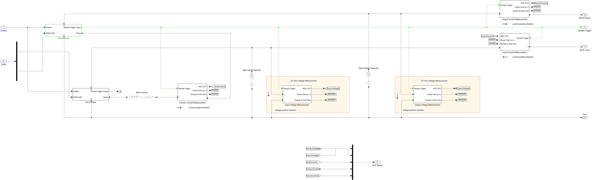

# FSBB MATLAB/Simulink UDP SIL

This project runs the same FSBB controller source used by the embedded target against
`MCS_STD_FSBB_MODEL.slx`. The controller executable and the Simulink model exchange raw
ADC codes, PWM compare values, Enable, and monitor channels through the GMP ASIO UDP
interface.

## Power-stage wiring contract

The intended non-inverting four-switch buck-boost power path is:

```text
Vin+ -> Buck half bridge midpoint -> L -> Boost half bridge midpoint -> Vout+
Vin- ---------------------------------------------------------------> Vout-
```

The external source is connected across `Buck_Input` and the common negative rail. The
20-ohm load is connected across `Boost_Output` and the common negative rail. The input
and output capacitors are connected from their corresponding positive nets to the common
negative rail.

| Signal | Physical meaning and positive direction |
| --- | --- |
| Buck PWM / CH1 | Upper switch of the input-side Buck half bridge; compare is proportional to upper-switch duty in the Simulink phase block. |
| Boost PWM / CH2 | Controller command is low-side Q4 duty. The model phase input is upper-side Q3 duty, so `xplt.ctl_interface.h` sends the complement. |
| `IL` | Main-inductor current, positive from the Buck midpoint toward the Boost midpoint. |
| `Iin` | Buck-side/input current, positive from the source into the converter. Diagnostic only in the present controller. |
| `Iout` | Boost-side/output current, positive from the converter into the load. |
| `Vin` | `Buck_Input` relative to the common negative rail. |
| `Vout` | `Boost_Output` relative to the common negative rail. |

The PWM vector contract is strictly `[Buck, Boost]`. The original model crossed the two
Demux outputs (CH1 drove Boost and CH2 drove Buck); `configure_fsbb_model.m` now repairs
and preserves the correct connection. Do not swap these two channels to compensate for
gate polarity.

The model wiring snapshots used during validation are recorded here:




## ADC and UDP channel contract

The sensor subsystems quantize their physical inputs and directly output ADC codes. The
model-to-controller vector is:

1. input voltage (`Vin`)
2. output voltage (`Vout`)
3. inductor current (`IL`)
4. Boost-side output current (`Iout`)
5. Buck-side input current (`Iin`, diagnostic channel)

The controller currently consumes the first four channels. With the configured 12-bit,
1.65 V-biased bidirectional current sensors, zero current is approximately code 2048.

## SDPE and grouped model mask

`sdpe_mgr/sdpe_requirement.json` is the source of truth for control, PWM, ADC, sensor,
power-stage, and semiconductor parameters. Generate both artifacts after changing it:

```powershell
python E:\lib\gmp_pro\tools\SDPE_v2\sdpe.py generate-project-local sdpe_mgr\sdpe_requirement.json --project-dir sdpe_mgr
python E:\lib\gmp_pro\tools\SDPE_v2\sdpe.py generate-project-matlab-local sdpe_mgr\sdpe_requirement.json --project-dir sdpe_mgr
```

Run `configure_fsbb_model` after changing mask bindings or internal wiring. The
`GMP STD FSBB Module` mask is divided into six groups:

- PWM Configuration
- Power Stage
- Semiconductor Model
- ADC Configuration
- Voltage Sensors
- Current Sensors

The generated C header configures the controller executable. The generated MATLAB script
initializes every corresponding model-mask expression.

## Simulation startup sequence

Under `SPECIFY_PC_ENVIRONMENT`, `init()` disables control-word decoding and preloads
`CIA402_CMD_ENABLE_OPERATION`. `CIA402_CONFIG_ENABLE_SEQUENCE_SWITCH` then advances the
normal CiA402 sequence instead of bypassing it:

```text
Not Ready -> Switch On Disabled -> Ready -> Switched On -> Operation Enabled
```

The normal callbacks therefore retain the wait stages and ADC-calibration hook. ADC bias
calibration is disabled for this model because each sensor already generates the configured
bias code. Enable is committed only after freshly calculated PWM compares have been placed
in the same outgoing UDP frame.

## Build and run

Build `GMP_Motor_Control_simulink.sln` as `Debug|x64`. The required UDP S-function is
loaded by the model callback from
`tools/gmp_sil/udp_helper_v2/mdl_asio_helper/bin/x64/Debug`.

For a normal run with the currently generated BUILD_LEVEL:

```matlab
cd('E:/lib/gmp_pro/ctl/suite/dps_fsbb/project/simulate');
out = run_fsbb_cosim(1.5);
```

For a recorded validation run, first select BUILD_LEVEL in
`sdpe_mgr/sdpe_requirement.json`, regenerate C/MATLAB settings, rebuild Debug|x64, and run:

```matlab
metrics = run_fsbb_validation(BUILD_LEVEL, stop_time_seconds);
```

The runner checks that the generated header matches the requested level, starts and stops
the controller automatically, adds logging blocks only to the in-memory model, and writes
waveforms plus JSON metrics under `validation/`. UDP ports in `network.json` are 12500/12501
for data and 12502/12503 for commands.

## BUILD_LEVEL 1 -> 3 validation record

The final committed default is BUILD_LEVEL=3. Each row below was generated after rebuilding
the executable for that exact level.

| Level | Control objective | Stop time | Result |
| --- | --- | ---: | --- |
| 1 | Open-loop voltage command, with the common `slope_limiter` soft start | 0.9 s | 12.0 V formal command; Vout 11.408 V with modeled switching/conduction loss; peak 11.795 V; IL 0.591 A; no fault. |
| 2 | Inductor-current closed loop | 1.2 s | 5.000 A target and 5.000 A measured; Vout 46.779 V into 20 ohm; no fault. |
| 3 | Output-voltage outer loop plus inductor-current inner loop | 1.5 s | 24.000 V target and 24.000 V measured; peak 24.037 V (about 0.15% overshoot); IL 1.340 A; Iout 1.198 A; no fault. |

### BUILD_LEVEL=1


### BUILD_LEVEL=2


### BUILD_LEVEL=3


All three runs ended in CiA402 `Operation Enabled` with Enable=1. The controller soft-start
uses the existing `ctl/component/intrinsic/basic/slope_limiter.h` implementation through
the DCDC core's `ramp_v` and `ramp_i` instances.
