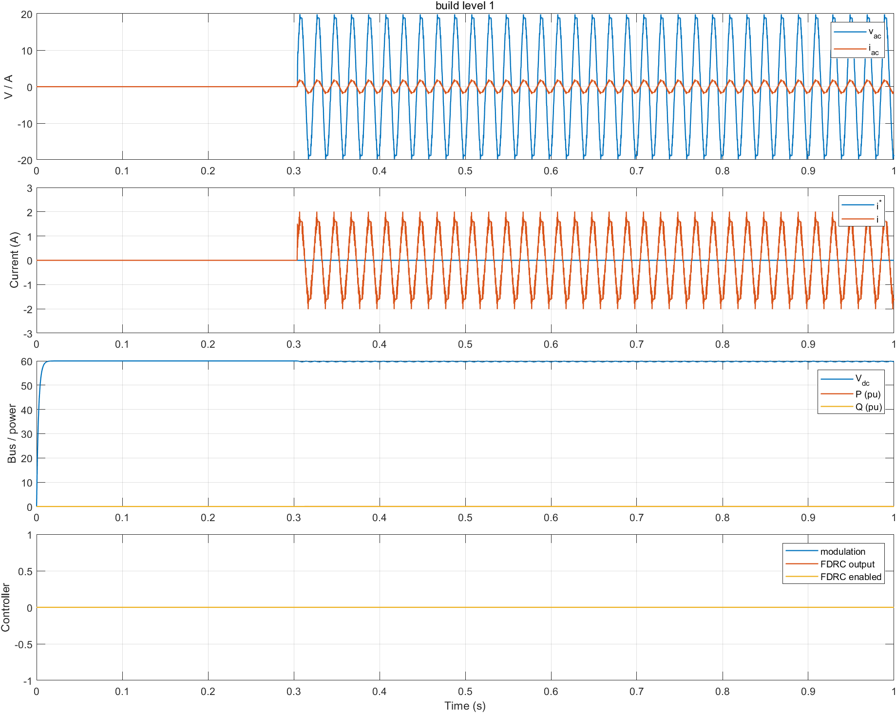
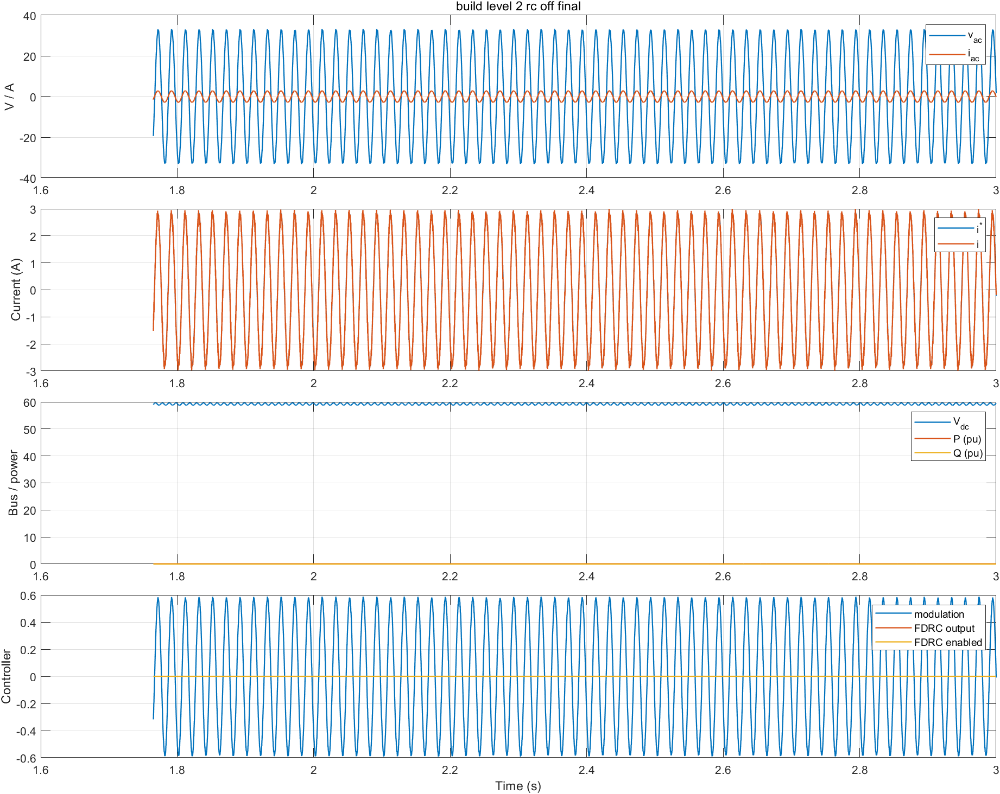
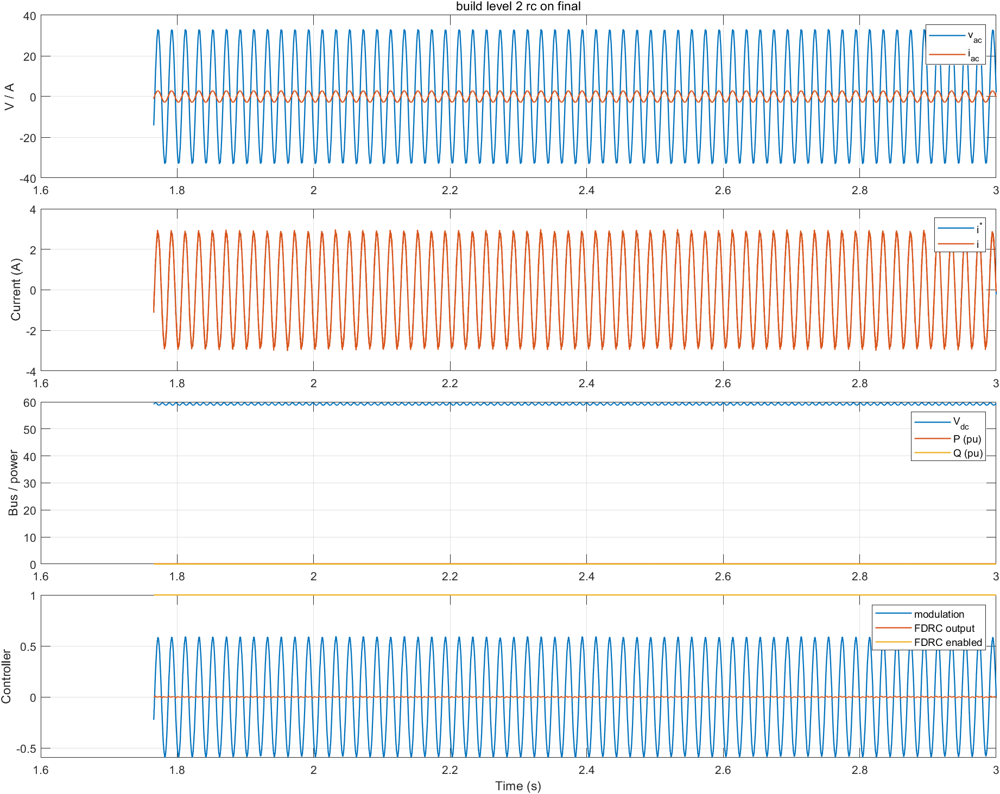
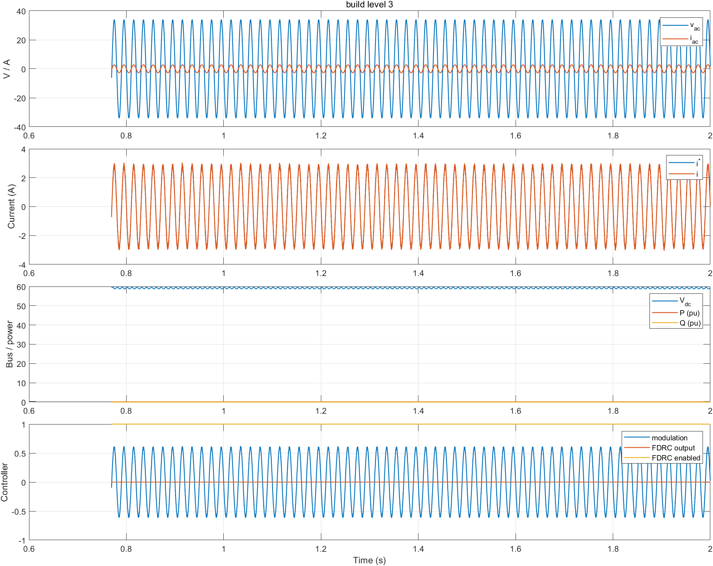
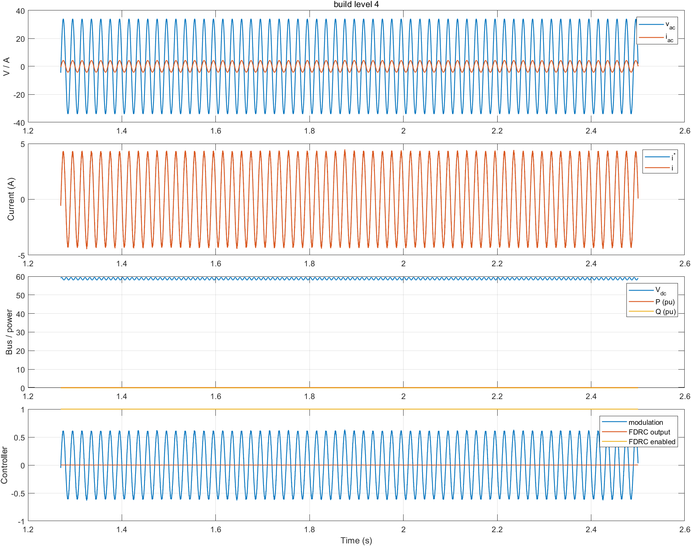
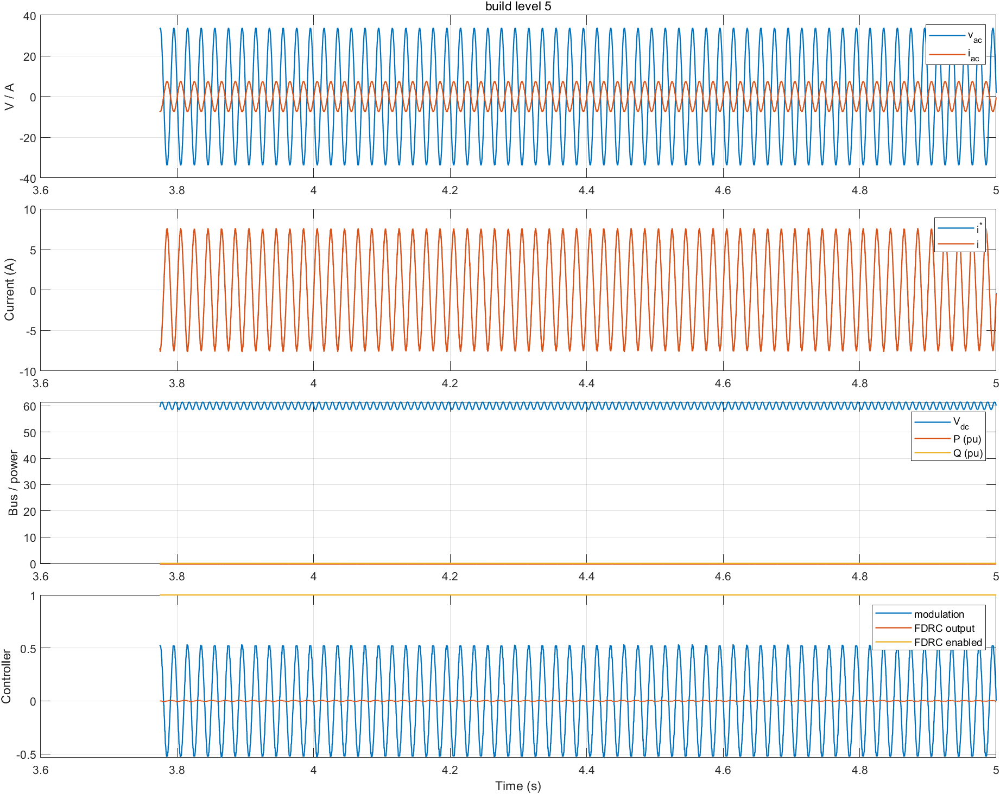

# SINV UDP/SIL 联合仿真实验报告

## 1. 实验目的与完成状态

本实验验证单相双向整流/逆变器从硬件接口到外环控制的完整软件链路：

1. BUILD_LEVEL 1：电阻负载下的正弦电压开环；
2. BUILD_LEVEL 2：电阻负载下的电流闭环、输出电压锁相和重复控制；
3. BUILD_LEVEL 3：并网有符号 P/Q 指令电流环；
4. BUILD_LEVEL 4：并网有功功率闭环；
5. BUILD_LEVEL 5：整流运行下的直流母线电压闭环。

当前版本已完成 1–5 全过程验证。最终交付配置为 `BUILD_LEVEL=(5)`，仿真自动经历 CiA402 等待、ADC 校准/准入检查和 `ENABLE_OPERATION`，不需要手动修改控制器命令。

## 2. 目录与关键文件

仿真工作目录：

```text
E:\lib\gmp_pro\ctl\suite\pgs_sinv_rc\project\simulate
```

| 文件 | 用途 |
| --- | --- |
| `PGS_STD_SINV_MODEL_RLOAD.slx` | BL1/2，交流侧电阻负载 |
| `PGS_STD_SINV_MODEL_Grid.slx` | BL3/4，直流源与交流电网同时存在 |
| `PGS_STD_SINV_MODEL_Rectifier.slx` | BL5，交流电网供电、直流侧电阻负载 |
| `../../sdpe_general/sdpe_requirement.json` | 跨平台公共控制参数和功能开关 |
| `sdpe_mgr/sdpe_requirement.json` | simulate 平台、功率级、传感器和 BUILD_LEVEL 参数 |
| `configure_sinv_models.m` | 将两层 SDPE 脚本绑定到三个模型并配置 Mask |
| `GMP_Motor_Control_simulink.sln` | Windows x64 SIL 控制器工程 |
| `run_sinv_cosim.m` | 根据 BUILD_LEVEL 自动选择模型并运行 |
| `run_sinv_validation.m` | 自动记录波形、稳态指标和电流 THD |

## 3. 软件环境

已验证环境为 Windows、MATLAB/Simulink R2024b 和 Visual Studio C++ x64 工具链。MATLAB 需要模型所用的 Simscape Electrical/电力电子模块，并能加载：

```text
E:\lib\gmp_pro\tools\gmp_sil\udp_helper_v2\mdl_asio_helper\bin\x64\Debug
```

模型回调会自动加入 UDP S-function、公共 SDPE MATLAB 脚本和项目 SDPE MATLAB 脚本。SDPE 生成依赖可用的 Python 环境。

## 4. 两层 SDPE 配置规则

公共层：

```text
E:\lib\gmp_pro\ctl\suite\pgs_sinv_rc\sdpe_general\sdpe_requirement.json
```

适合设置：电流环、PLL、QPR/FDRC、P/Q 指令、功率环、母线电压环和跨平台功能开关。

simulate 项目层：

```text
E:\lib\gmp_pro\ctl\suite\pgs_sinv_rc\project\simulate\sdpe_mgr\sdpe_requirement.json
```

适合设置：BUILD_LEVEL、控制/PWM 频率、ADC、传感器、主电路、负载、保护阈值和仿真自动使能。

只编辑这两个 requirement 文件。以下文件均为生成物，不应手工修改：

```text
src\sdpe_pgs_sinv_rc_common_settings.h
src\sdpe_pgs_sinv_rc_common_settings_matlab_init.m
project\simulate\sdpe_mgr\sdpe_pgs_sinv_rc_simulate_settings.h
project\simulate\sdpe_mgr\sdpe_pgs_sinv_rc_simulate_settings_matlab_init.m
```

## 5. 接线和数据映射

ADC 总线顺序必须保持不变：

| 索引 | 模型信号 | 控制器用途 |
| ---: | --- | --- |
| 0 | `IL` | 交流电感/并网电流 `adc_i_ac` |
| 1 | `IDC` | 直流侧电流，预留诊断 |
| 2 | `VDC` | 直流母线电压 `adc_v_bus` |
| 3 | `IC` | 滤波电容电流，预留诊断 |
| 4 | `VC` | 输出/电网电压 `adc_v_grid` |
| 5 | `IG` | 网侧支路电流，预留诊断 |

PWM 通道 1 驱动全桥 L 桥臂，通道 2 驱动 N 桥臂，`output_enable` 同时控制两个桥臂。UDP 数据端口为 12500/12501，命令端口为 12502/12503。

控制器返回的 16 个监测量依次是：`Vac`、`Iac`、`Vdc`、`Iref`、调制波、PLL 频率、P、Q、电流误差、QPR 输出、FDRC 输出、FDRC 使能、CiA402 状态、CiA402 命令、活动故障、控制器发散诊断值。

## 6. 关键参数与物理约束

### 6.1 simulate 项目层

| 参数 | 当前值 | 说明 |
| --- | ---: | --- |
| `CONTROLLER_FREQUENCY` | 20 kHz | 控制器采样频率 |
| `SINV_PWM_FREQUENCY_HZ` | 20 kHz | 模型开关频率 |
| `CTRL_DCBUS_VOLTAGE` | 60 V | BL1–4 直流源/额定母线 |
| `CTRL_GRID_VOLTAGE_RMS` | 24 Vrms | 并网交流源 |
| `CTRL_RATED_CURRENT_RMS` | 10 Arms | 额定交流电流 |
| `CTRL_AC_INDUCTANCE` | 480 µH | 交流滤波电感 |
| `SINV_FILTER_CAPACITANCE_F` | 22 µF | 交流滤波电容 |
| `SINV_DC_CAPACITANCE_F` | 2200 µF | 直流母线电容 |
| `SINV_RLOAD_OHM` | 12 Ω | BL1/2 交流侧负载 |
| `SINV_RECTIFIER_RLOAD_OHM` | 30 Ω | BL5 直流侧负载 |
| `CTRL_ADC_RESOLUTION` | 12 bit | ADC 量化位数 |
| `CTRL_PROT_IAC_PEAK_MAX` | 18 A | 瞬时交流过流保护 |

BL5 必须使用独立的 30 Ω 直流负载。60 V/30 Ω 对应 120 W 和约 5 Arms 网侧电流；若误用 12 Ω，则需要 300 W、约 12.5 Arms，超过当前电流指令范围，母线只能停在约 48 V并产生严重削顶。这属于功率不匹配，不应通过增大 PI 增益处理。

### 6.2 公共控制层

| 参数 | 当前值 | 说明 |
| --- | ---: | --- |
| `SINV_CURRENT_LOOP_BANDWIDTH_HZ` | 600 Hz | 电流环目标带宽 |
| `SINV_FDRC_ENABLE_DELAY_MS` | 300 ms | 进入运行态后延迟投入 RC |
| `SINV_FDRC_LEARNING_GAIN` | 0.10 | 重复控制学习增益 |
| `SINV_FDRC_Q_FILTER_HZ` | 1000 Hz | RC 鲁棒性低通截止频率 |
| `SINV_FDRC_LEAD_STEPS` | 3 | 数字/功率级延迟补偿步数 |
| `SINV_LEVEL1_VOLTAGE_REF_PU` | 0.35 pu | BL1 正弦电压幅值 |
| `SINV_LEVEL2_CURRENT_REF_PEAK_PU` | 0.20 pu | BL2 正弦电流峰值 |
| `SINV_LEVEL3_ACTIVE_POWER_REF_PU` | +0.10 pu | BL3 逆变送电指令 |
| `SINV_LEVEL4_ACTIVE_POWER_REF_PU` | +0.15 pu | BL4 功率环目标 |
| `SINV_DC_BUS_REF_V` | 60 V | BL5 母线电压目标 |
| `SINV_OUTER_LOOP_FREQUENCY_HZ` | 1 kHz | 功率/母线外环执行频率 |

功率符号约定：正有功表示逆变器向电网注入能量，负有功表示从电网吸收能量并整流到直流侧。

## 7. 从配置到启动仿真的完整步骤

### 7.1 关闭旧控制器和模型

关闭旧的 `Motor_Control_Suite_SIL_Env.exe`、仍在运行的 Simulink 仿真以及占用 `.slx` 的其他 MATLAB 会话，避免 UDP 端口冲突或模型保存失败。

### 7.2 设置 BUILD_LEVEL 和参数

在项目层 requirement 中设置：

```json
{"macro":"BUILD_LEVEL", "enabled":true, "value":"(5)"}
```

根据实验选择 `(1)` 至 `(5)`。控制指令和环路参数在公共层修改，模型/传感器参数在项目层修改。

### 7.3 依次生成两层 SDPE

公共层必须先生成：

```bat
cd /d E:\lib\gmp_pro\ctl\suite\pgs_sinv_rc\sdpe_general
sdpe_generate.bat
cd /d E:\lib\gmp_pro\ctl\suite\pgs_sinv_rc\project\simulate\sdpe_mgr
sdpe_generate.bat
```

两个脚本都应显示 `validation passed`。切换 BUILD_LEVEL、RC 开关、控制目标或模型参数后必须重新执行。

### 7.4 配置并更新三个模型

在 MATLAB 中运行：

```matlab
cd('E:/lib/gmp_pro/ctl/suite/pgs_sinv_rc/project/simulate');
configure_sinv_models;
```

脚本会保存三个模型，并把 Mask 分为 PWM、开关器件、交流滤波器、直流母线、ADC、电压传感器和电流传感器。执行前不要在其他 MATLAB 会话中打开这些模型。

功率级是经过项目级定制的库模块，保存时可能提示 disabled library links；这表示本地 Mask/接线不再自动跟随原库，并不代表编译或模型更新失败。不要直接 Restore Link，否则可能覆盖已验证的项目接线。

### 7.5 编译 SIL 控制器

使用 Visual Studio 打开 `GMP_Motor_Control_simulink.sln`，选择 `Debug|x64` 并 Rebuild；或在 Developer PowerShell 中执行：

```bat
cd /d E:\lib\gmp_pro\ctl\suite\pgs_sinv_rc\project\simulate
msbuild GMP_Motor_Control_simulink.sln /m /t:Rebuild /p:Configuration=Debug /p:Platform=x64
```

输出文件为：

```text
x64\Debug\Motor_Control_Suite_SIL_Env.exe
```

### 7.6 启动普通联合仿真

让 MATLAB 脚本启动控制器，不要先手工双击 EXE：

```matlab
out = run_sinv_cosim(5, 5.0);
```

脚本按 BUILD_LEVEL 自动选择模型。第一个参数必须和已生成、已编译的 BUILD_LEVEL 相同。

### 7.7 启动自动验证并生成报告

```matlab
metrics = run_sinv_validation(5, 5.0, 'build_level_5');
```

脚本会自动启动/停止控制器，记录 16 个监测量和 PWM/Enable，计算稳态 RMS、P/Q、PLL 频率、电流误差与 THD，并将 PNG/JSON 写入 `project/simulate/validation/`。

## 8. BUILD_LEVEL 分级实验

| 级别 | 模型 | 建议时长 | 主要判据 |
| --- | --- | ---: | --- |
| BL1 | RLOAD | 1.0 s | 输出为正弦波；ADC/PWM/Enable 正常；不要用该级 PLL 频率判断锁相性能 |
| BL2 | RLOAD | ≥3.0 s | 电流跟踪约 2 Arms；PLL 接近 50 Hz；可比较 RC 开/关 THD |
| BL3 | Grid | ≥2.0 s | P 跟随有符号指令，Q 接近 0；PLL 稳定；正负功率方向正确 |
| BL4 | Grid | ≥2.5 s | 测量 P 收敛到功率环目标；电流内环无持续饱和 |
| BL5 | Rectifier | ≥5.0 s | Vdc 收敛到 60 V；P 为负；直流负载功率处于额定范围 |

严格按 1→5 顺序推进。BL1 先排除硬件接口问题；BL2 确认电流环与 PLL；BL3 确认并网方向和双向能量流；BL4/5 才投入慢外环。

## 9. FDRC 开关对比方法

公共 requirement 中：

```json
{"macro":"SINV_ENABLE_REPETITIVE_CONTROL", "enabled":true}
```

- RC 开启：保持 `enabled=true`；
- RC 关闭：设置为 `enabled=false`；
- 每次切换后重新生成公共层和项目层、重新编译，再以相同 BUILD_LEVEL、模型、指令和仿真时长运行。

建议 BL2 至少运行 3 s，因为 RC 在进入运行态 300 ms 后才投入并需要多个基波周期学习。比较时使用相同稳态窗口，重点查看 `iac_thd_percent`、`current_error_rms_pu` 和 `fdrc_output_rms_pu`，不能用不同仿真时长进行对比。

## 10. 已验证结果

| 级别 | 关键稳态结果 | THD | 状态 |
| --- | --- | ---: | --- |
| BL1 | Vac 13.629 Vrms，Iac 1.181 Arms | 3.830% | Enable=1，故障=0 |
| BL2 RC 关闭 | Iac 2.0004 Arms，指令 1.9986 Arms，PLL 49.8749 Hz | 0.8868% | Enable=1，故障=0 |
| BL2 RC 开启 | Iac 2.0002 Arms，指令 1.9985 Arms，PLL 49.8752 Hz | 0.8766% | Enable=1，故障=0 |
| BL3 | P 0.09997 pu，Q 0.00011 pu，PLL 49.99998 Hz | 1.890% | Enable=1，故障=0 |
| BL4 | P 0.14994 pu，目标 0.15 pu，Q 0.00013 pu | 1.591% | Enable=1，故障=0 |
| BL5 | Vdc 60.0075 V，Iac 5.167 Arms，P -0.2555 pu | 3.019% | Enable=1，故障=0 |

在线性电阻负载且 QPR 基础 THD 已低于 0.9% 时，FDRC 将 BL2 THD 从 0.8868% 降到 0.8766%，改善较小但方向正确。非线性负载、死区和周期性扰动更强时通常更能体现 RC 的价值，但必须重新评估学习增益、Q 滤波器和相位超前。

### 10.1 BL1 电压开环



原始指标：[build_level_1_metrics.json](results/build_level_1_metrics.json)

### 10.2 BL2 电流环与 FDRC





原始指标：[RC 关闭](results/build_level_2_rc_off_metrics.json)；[RC 开启](results/build_level_2_rc_on_metrics.json)

### 10.3 BL3 并网电流环



原始指标：[build_level_3_metrics.json](results/build_level_3_metrics.json)

### 10.4 BL4 功率闭环



原始指标：[build_level_4_metrics.json](results/build_level_4_metrics.json)

### 10.5 BL5 直流母线电压闭环



原始指标：[build_level_5_metrics.json](results/build_level_5_metrics.json)

BL5 启动前段由功率级体二极管形成被动整流，随后控制器接管并提升母线。发散诊断节点可能保留接管瞬间的历史峰值，但正式判据是 `active_errors_final=0`、电流环恢复跟踪并且 Vdc 稳定在目标值。

## 11. 常见问题

| 现象 | 检查与处理 |
| --- | --- |
| `BuildLevelMismatch` | BUILD_LEVEL 已修改但项目层未生成或 EXE 未重编译 |
| 运行了错误模型 | 使用 `run_sinv_cosim`/`run_sinv_validation` 自动选模；BL1/2=RLOAD，BL3/4=Grid，BL5=Rectifier |
| UDP 连接失败 | 关闭旧控制器和旧仿真，检查 12500–12503 端口 |
| 模型无法保存 | 同一 `.slx` 被另一个 MATLAB 会话占用 |
| 找不到 UDP S-function | 检查 `mdl_asio_helper/bin/x64/Debug` 是否存在并与 MATLAB 架构一致 |
| Enable 一直为 0 | 检查 ADC 校准、Vdc ready、PLL lock、保护位和 CiA402 状态，不要强制旁路状态机 |
| BL3/4 功率方向错误 | 核对 P 符号、PLL alpha/beta 定义和交流电流正方向；正 P 应向电网送电 |
| BL5 母线达不到 60 V | 先算负载功率和所需网侧电流；确认使用 30 Ω，而不是盲目提高 PI 增益 |
| BL5 启动时调制饱和 | 检查被动整流初值、母线 ready 范围和电流限幅；不要删除 OCP/OVP 保护 |
| RC 使能后效果不明显 | 延长仿真时间；确认 `fdrc_enabled=1`；用相同窗口比较 THD；必要时重新整定 RC 参数 |

## 12. 实验记录要求

每次正式实验应保存：两层 requirement 版本、BUILD_LEVEL、使用的模型、仿真时长、编译配置、JSON 指标和波形。只有在输出使能为 1、CiA402 状态为 4、活动故障为 0，并满足该级闭环目标后，才能把结果更新到本 `doc` 归档。
